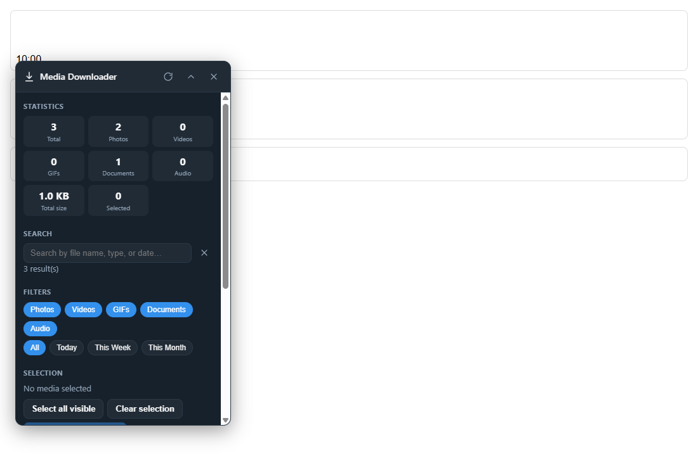
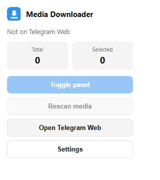
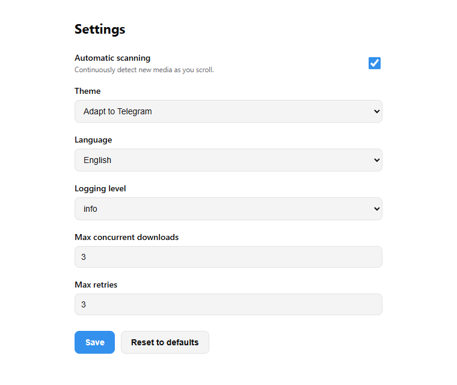

# Telegram Media Downloader

A production-quality **Manifest V3 Chrome Extension** that supercharges media
management on **Telegram Web** (both **Web K** and **Web A**). It detects media
as you browse, organizes it in a centralized registry, and lets you search,
filter, bulk-select, bulk-download, and export reports — all from a draggable,
themeable floating panel.

> Built with TypeScript, Vite, and **native Web Components** (no React/Vue/Angular).



| Popup                                | Settings                                  |
| ------------------------------------ | ----------------------------------------- |
|  |  |

---

## Features

- **Telegram detection** — recognizes Web K and Web A, verifies a supported
  environment, login state, and required DOM, with graceful fallback.
- **Media discovery** — detects photos, videos, GIFs, documents, and audio with
  incremental, duplicate-free scanning.
- **Centralized registry** — O(1) add/lookup/remove/update with secondary
  type indexes.
- **Selection system** — single, multi, select-all-visible, and clear, with
  `Ctrl/Cmd+A` and `Esc` keyboard shortcuts.
- **Download queue** — concurrency control, retry with backoff, per-task
  progress, and cancellation (`queued → running → completed | failed | cancelled`).
- **Search** — fuzzy + partial matching over file name, type, and date.
- **Filtering** — by media type and by `Today` / `This Week` / `This Month`.
- **Reporting** — export the current view as **CSV** or **JSON** (with CSV
  injection hardening).
- **Floating panel** — draggable, collapsible, position-persistent, with
  Statistics, Search, Filters, Selection, Queue, and Logs sections.
- **Theming** — Light, Dark, and automatic Telegram-theme adaptation via CSS
  variables.
- **i18n** — English and Turkish, with an architecture ready for more languages.
- **Accessibility** — keyboard navigable, ARIA labels, screen-reader friendly,
  WCAG AA-minded contrast and focus states.
- **Security** — no `eval`, no `Function` constructor, no `innerHTML` of
  untrusted data; CSP-compliant; all text rendered via `textContent`.

---

## Installation (load the unpacked extension)

1. **Build** the extension:

   ```bash
   npm install
   npm run build
   ```

   This produces a ready-to-load extension in the `dist/` folder.

2. Open `chrome://extensions` in Chrome (or any Chromium browser).
3. Enable **Developer mode** (top-right).
4. Click **Load unpacked** and select the **`dist/`** folder.
5. Open <https://web.telegram.org/k/> or <https://web.telegram.org/a/>, log in,
   and open a chat that contains media. The floating panel appears
   automatically; click the toolbar icon for the popup.

---

## Build & development

| Command                 | Description                                           |
| ----------------------- | ----------------------------------------------------- |
| `npm install`           | Install dependencies.                                 |
| `npm run dev`           | Rebuild on change (development mode, watch).          |
| `npm run build`         | Type-check and produce the production `dist/` bundle. |
| `npm run test`          | Run unit + integration tests (Vitest).                |
| `npm run test:coverage` | Run tests with coverage (90%+ thresholds enforced).   |
| `npm run test:e2e`      | Run Playwright end-to-end tests (build first).        |
| `npm run lint`          | Lint with ESLint (zero-warning policy).               |
| `npm run format`        | Format the codebase with Prettier.                    |

### Project layout

```
src/
  background/      # MV3 service worker + download manager
  content/         # detector, scanner, registry, mutation engine, controller, bootstrap
  features/        # download, selection, search, filter, reporting, local-storage
  ui/              # web components, styles, icons, theming
  shared/          # types, constants, utils, logger, errors, i18n, DI container
  popup/           # toolbar popup
  options/         # settings page
  _locales/        # manifest i18n (en, tr)
tests/             # unit, integration, e2e
docs/              # ARCHITECTURE, CONTRIBUTING, CHANGELOG, screenshots
```

See [`docs/ARCHITECTURE.md`](docs/ARCHITECTURE.md) for the full design.

---

## How it works (in 30 seconds)

1. The **content script** boots, runs **detection**, and (if supported) mounts
   the floating panel.
2. The **MediaScanner** reads the visible message DOM and pushes
   `MediaItem`s into the **MediaRegistry**.
3. A debounced, batched **MutationEngine** feeds only newly-added subtrees back
   to the scanner, so updates stay fast on huge channels.
4. The **AppController** wires the registry to **search/filter/selection** and a
   **download queue**, exposing one reactive `PanelViewModel` to the UI.
5. Downloads are executed by the **background service worker** through
   `chrome.downloads` (content scripts can't call it directly).

---

## Performance

- Initial scan target **< 2s**; incremental updates target **< 100ms**.
- O(1) registry operations and per-type indexes.
- Mutation observation uses **debouncing + batching** and never triggers a full
  rescan — only changed subtrees are processed.
- Built to handle **10,000+ messages** and large channels/groups with controlled
  memory growth (bounded log buffer, deduplicated scan markers).

---

## Privacy & permissions

| Permission                           | Why it's needed                                     |
| ------------------------------------ | --------------------------------------------------- |
| `storage`                            | Persist settings, filters, panel state, statistics. |
| `downloads`                          | Save selected media to disk.                        |
| `scripting`                          | Reserved for resilient injection on SPA navigation. |
| `host_permissions: web.telegram.org` | Run only on Telegram Web; no other site is touched. |

The extension makes **no external network requests** of its own and stores
everything locally via `chrome.storage.local`.

---

## Troubleshooting

| Symptom                            | Fix                                                                                                                  |
| ---------------------------------- | -------------------------------------------------------------------------------------------------------------------- |
| Panel doesn't appear               | Ensure you're on `web.telegram.org`, logged in, and have opened a chat with media. Use the popup's **Toggle panel**. |
| "Not on Telegram Web" in the popup | The active tab isn't a Telegram Web page. Open Telegram Web first.                                                   |
| No media detected                  | Scroll the chat to load media, then click **Rescan**. Telegram virtualizes the list.                                 |
| Downloads don't start              | Check Chrome's download settings/permissions; confirm the `downloads` permission is granted.                         |
| Telegram changed its markup        | Update the selectors in `src/shared/constants/selectors.ts` (centralized on purpose).                                |
| Panel off-screen                   | It auto-clamps to the viewport on load; drag it back or reset via reloading the page.                                |

For developers: set **Logging level** to `debug` in Settings to see detailed
logs in the panel's **Logs** section and the console.

---

## License

MIT — see [`LICENSE`](LICENSE).
